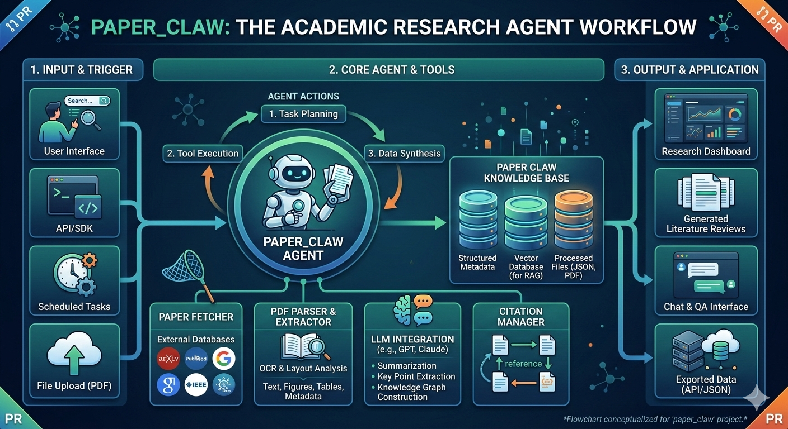

<div align="center">

# 📰 Article Claw

**Intelligent arXiv Paper Digest Generator**

[](https://www.python.org/)
[](LICENSE)
[](.github/workflows/daily_digest.yml)
[](https://www.moonshot.cn/)

*Automatically fetch, classify, and summarize arXiv papers in speech & audio daily*

[English](README.md) · [简体中文](README_CN.md) · [Quick Start](#quick-start) · [Configuration](#configuration) · [View Example](examples/sample_digest_excerpt.md)

</div>

---

## ✨ Features

| Feature | Description |
|---------|-------------|
| 🤖 **Auto Fetch** | Daily scheduled fetching of latest papers from arXiv |
| 📊 **Smart Classification** | Automatically categorize papers into 7 domains |
| 📝 **Chinese Summary** | Generate high-quality Chinese summaries via **Kimi AI** or **OpenAI** |
| 📧 **Email Delivery** | Support multiple recipients with HTML email digest |
| 👥 **Recipient Management** | Configure multiple recipients via JSON file |
| ⚙️ **Config-Driven** | Customize domains and categories without code changes |
| 🔄 **State Persistence** | Automatic deduplication to avoid reprocessing |
| 🤖 **LLM Fallback** | Automatic fallback when API is unavailable |

## 🏗️ System Architecture



## 📂 Default Categories

- **🗣️ Speech LLM** - Speech Large Language Models
- **🎤 ASR** - Automatic Speech Recognition
- **🔊 TTS** - Text-to-Speech / Speech Synthesis
- **✨ Enhancement** - Speech Enhancement
- **🧠 SLU** - Spoken Language Understanding
- **😊 Paralinguistics** - Paralinguistics & Affective Computing
- **🎵 Audio** - General Audio Processing

## 🚀 Quick Start

### 1. Environment Setup

```bash
# Clone the repository
git clone https://github.com/yourusername/article_claw.git
cd article_claw

# Create virtual environment
conda create -n article_claw python=3.11 -y
conda activate article_claw
pip install -r requirements.txt
```

### 2. Local Configuration

Create `.env` file for local configuration (auto-loaded by the program):

```bash
# Copy from template
cp .env.example .env

# Edit .env with your settings
SMTP_HOST=smtp.qq.com
SMTP_PORT=465
SMTP_USER=your-email@qq.com
SMTP_PASS=your-auth-code
MOONSHOT_API_KEY=sk-your-kimi-api-key
```

### 3. Configure Recipients

Create `config/recipients.json` to manage email recipients:

```bash
# Copy from template
cp config/recipients.example.json config/recipients.json
```

Edit `config/recipients.json`:

```json
{
  "recipients": [
    {
      "email": "professor@university.edu.cn",
      "name": "Professor",
      "enabled": true
    },
    {
      "email": "student@university.edu.cn",
      "name": "Student",
      "enabled": true
    }
  ]
}
```

### 4. Run

```bash
# Run today's digest
python scripts/main.py

# Run for specific date
python scripts/main.py --day 2026-03-10

# Custom date range
python scripts/main.py --start-date 2026-03-01 --end-date 2026-03-10
```

---

## 🤖 AI-Powered Summaries

Article Claw supports **Kimi AI** (recommended) and **OpenAI** for high-quality Chinese summaries.

### Kimi AI (Recommended for Chinese)

Kimi (Moonshot AI) provides better Chinese language understanding.

**Setup:**
```bash
# Add to .env
MOONSHOT_API_KEY=sk-your-kimi-api-key
```

**Features:**
- Native Chinese language understanding
- Better context comprehension
- Automatic fallback on rate limit

### OpenAI

```bash
# Add to .env
OPENAI_API_KEY=sk-your-openai-api-key
```

### Fallback Strategy

The system uses intelligent fallback:

```
Kimi API → OpenAI API → Rule-based Generation
```

Even without API keys, the system generates summaries using rule-based methods.

---

## 📧 Email Configuration

### SMTP Settings (in `.env`)

| Service | SMTP_HOST | SMTP_PORT | Notes |
|---------|-----------|-----------|-------|
| QQ Mail | smtp.qq.com | 465 | Use Authorization Code |
| 163 Mail | smtp.163.com | 465 | Use Authorization Code |
| Gmail | smtp.gmail.com | 465 | Use App Password |

### Multiple Recipients

Configure in `config/recipients.json`:
- Add any number of recipients
- Enable/disable individually
- Changes take effect immediately

---

## ⚙️ Configuration

### Domain Categories

Edit `config/default.json` to customize paper categories:

```json
{
  "sources": {
    "categories": ["cs.SD", "eess.AS"]
  },
  "classification": {
    "categories": [
      {
        "name": "ASR",
        "label_zh": "Speech Recognition",
        "keywords": ["asr", "speech recognition"]
      }
    ]
  }
}
```

---

## 📁 Project Structure

```
article_claw/
├── .github/workflows/      # GitHub Actions configuration
├── assets/                 # Assets (logos, figures)
├── config/
│   ├── default.json        # Domain configuration
│   ├── recipients.json     # Email recipients (private)
│   └── recipients.example.json  # Recipient template
├── content/posts/          # Generated digests
├── data/
│   ├── raw/               # Raw data
│   └── processed/         # Processed data
├── scripts/               # Core scripts
├── templates/             # Output templates
├── .env                   # Local secrets (private)
├── .env.example           # Environment template
└── examples/              # Example outputs
```

---

## 🚀 Deployment

### Option 1: GitHub Actions (Recommended)

1. Fork this repository
2. Add secrets in Settings → Secrets:
   - `SMTP_HOST`, `SMTP_PORT`, `SMTP_USER`, `SMTP_PASS`
   - `MOONSHOT_API_KEY` or `OPENAI_API_KEY` (optional)
3. Enable Actions
4. Runs daily at UTC 01:00 (09:00 Beijing Time)

### Option 2: Local Cron Job

```bash
# Edit crontab
crontab -e

# Run daily at 9:00 AM
0 1 * * * cd /path/to/article_claw && python scripts/main.py >> /var/log/article_claw.log 2>&1
```

### Option 3: Windows Task Scheduler

```powershell
$Action = New-ScheduledTaskAction -Execute "python.exe" -Argument "D:\article_claw\scripts\main.py"
$Trigger = New-ScheduledTaskTrigger -Daily -At "09:00"
Register-ScheduledTask -TaskName "ArticleClaw-Daily" -Action $Action -Trigger $Trigger
```

---

## 📖 Sample Output

Generated digests include:

- 📅 Time window and paper statistics
- 📊 Distribution across domains
- 📝 Detailed information for each paper:
  - English title and full abstract
  - Author list and affiliations
  - **AI-generated Chinese summary** (via Kimi/OpenAI)
  - Readability analysis
  - arXiv link

[View Full Example →](examples/sample_digest_excerpt.md)

---

## 🌍 Language Support

- 🇨🇳 **Chinese** - Full Chinese summaries via Kimi AI or rule-based generation
- 🇺🇸 **English** - Original English paper metadata

---

## 🤝 Contributing

Contributions are welcome! Please see [CONTRIBUTING.md](CONTRIBUTING.md).

---

## 🗺️ Roadmap

- [x] Kimi AI integration for Chinese summaries
- [x] Multiple recipient management
- [x] Full-content email delivery
- [ ] Web UI for configuration
- [ ] RSS feed output
- [ ] Multi-language support (Japanese, Korean)

---

## 📄 License

[MIT License](LICENSE) © 2026 Article Claw Contributors

---

<div align="center">

**⭐ If you find this project helpful, please give us a star!**

</div>
