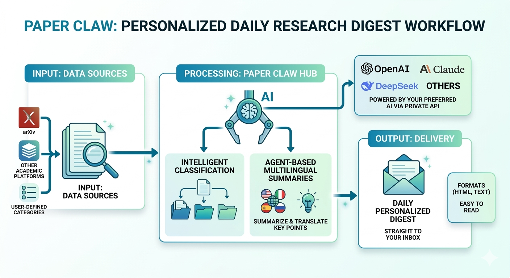
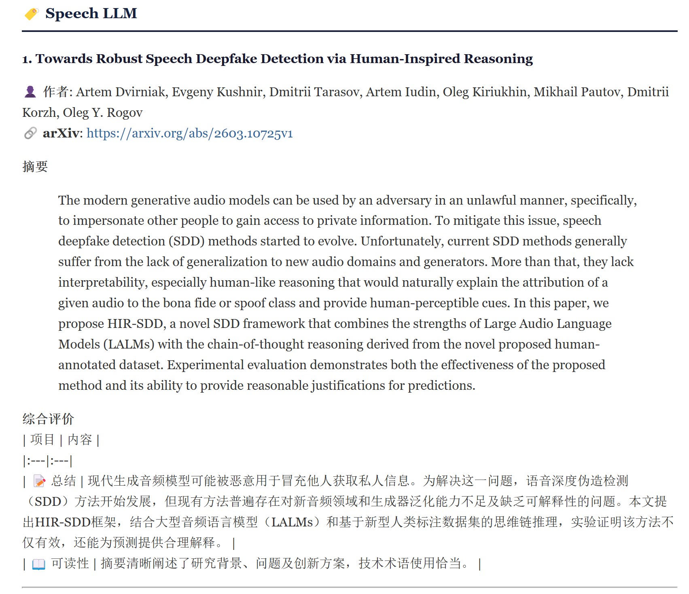
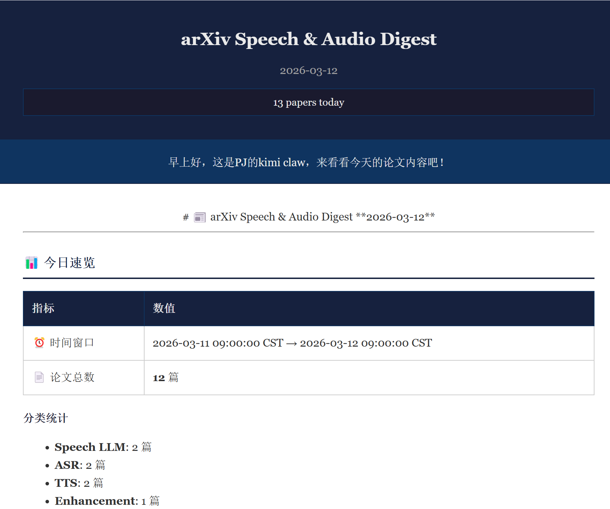

<div align="center">

# 📰 Paper Claw

**Intelligent Multi-Source Paper Digest Generator**

[](https://www.python.org/)
[](LICENSE)
[](.github/workflows/daily_digest.yml)
[](https://github.com/PigeonDan1/paper_claw)

*Fetch, classify, and summarize papers from multiple sources with AI-powered digests*

[Quick Start](#-for-human-users) · [Agent Skill](#-for-ai-agents) · [ArXiv Categories](#-arxiv-categories)

</div>

---

## 👥 Two Paths

Paper Claw serves two types of users:

<table>
<tr>
<td width="50%" valign="top">

### 🧑‍💻 For Human Users

**I want to set up daily paper digests for my research field**

→ [Quick Start Guide](#-for-human-users)

- Configure your research domain
- Set up email delivery
- Choose your LLM provider
- Run locally or via GitHub Actions

</td>
<td width="50%" valign="top">

### 🤖 For AI Agents

**I want to integrate Paper Claw into my agent workflow**

→ [Agent Skill Guide](#-for-ai-agents)

- **One-command preset setup** for any research field
- Standardized tool interface
- One-line Python integration
- JSON schema definitions
- Auto-discovery for OpenClaw

</td>
</tr>
</table>

### System Architecture

<div align="center">



*Paper Claw fetches from arXiv, classifies with AI, and delivers personalized digests*

</div>

---

### Example Output

<div align="center">

**Daily Digest in Your Inbox**



*Categorized papers with AI summaries, ready to read*

</div>

---

## 🧑‍💻 For Human Users

### Quick Start (5 minutes)

```bash
# 1. Clone repository
git clone https://github.com/PigeonDan1/paper_claw.git
cd paper_claw

# 2. Install dependencies
pip install -r requirements.txt

# 3. Configure environment
cp .env.example .env
cp config/recipients.example.json config/recipients.json

# 4. Edit config/default.json to select your research categories
# (See "ArXiv Categories" section below)

# 5. Run
python scripts/main.py --day 2026-03-11
```

### ⚙️ Configuration Guide

#### 1. Select Your Research Categories

Paper Claw provides **170+ arXiv categories** in `config/arxiv_categories.json`. The default configuration is set for **Speech & Audio** research, but you can easily customize it for your field.

**How to customize:**

1. Open `config/arxiv_categories.json` to browse available categories
2. Find your category codes (e.g., `cs.CL` for NLP, `cs.CV` for Computer Vision)
3. Edit `config/default.json` → `sources.arxiv.categories`

**Example configurations:**

```json
// For NLP Research
{
  "sources": {
    "arxiv": {
      "enabled": true,
      "categories": [
        {"id": "cs.CL", "name": "Computation and Language", "url": "https://arxiv.org/list/cs.CL/recent"},
        {"id": "cs.LG", "name": "Machine Learning", "url": "https://arxiv.org/list/cs.LG/recent"}
      ]
    }
  }
}

// For Computer Vision
{
  "sources": {
    "arxiv": {
      "enabled": true,
      "categories": [
        {"id": "cs.CV", "name": "Computer Vision", "url": "https://arxiv.org/list/cs.CV/recent"},
        {"id": "cs.MM", "name": "Multimedia", "url": "https://arxiv.org/list/cs.MM/recent"}
      ]
    }
  }
}
```

**Popular combinations:**

| Field | Categories |
|-------|------------|
| **Speech & Audio** (Default) | `cs.SD`, `eess.AS` |
| **AI/ML** | `cs.AI`, `cs.LG`, `cs.CL`, `cs.CV` |
| **NLP** | `cs.CL`, `cs.LG` |
| **Computer Vision** | `cs.CV`, `cs.MM` |
| **Computational Biology** | `q-bio.BM`, `q-bio.GN`, `q-bio.NC` |

#### 2. Set Up Email (SMTP)

Edit `.env`:

```bash
# QQ Mail Example
SMTP_HOST=smtp.qq.com
SMTP_PORT=465
SMTP_USER=your@qq.com
SMTP_PASS=your-auth-code  # Not your password!

# Gmail Example
# SMTP_HOST=smtp.gmail.com
# SMTP_PORT=465
# SMTP_USER=your@gmail.com
# SMTP_PASS=your-app-password
```

Edit `config/recipients.json`:

```json
{
  "recipients": [
    {"email": "you@example.com", "name": "Your Name", "enabled": true},
    {"email": "colleague@lab.edu", "name": "Colleague", "enabled": true}
  ]
}
```

**Personalized Greeting:** Each recipient will see a personalized greeting in their email:
> 👋 *Your Name, hello! This is PJ's paper assistant bringing you today's academic digest～*

The `name` field is used for this greeting and is displayed in the email header.

#### 3. Configure LLM Provider

Edit `.env` with at least one API key:

```bash
# Option 1: DeepSeek (Recommended for Chinese)
DEEPSEEK_API_KEY=sk-xxx
DEEPSEEK_API_BASE=https://models.sjtu.edu.cn/api/v1  # Optional: custom endpoint

# Option 2: Kimi (Moonshot)
MOONSHOT_API_KEY=sk-xxx

# Option 3: OpenAI
OPENAI_API_KEY=sk-xxx

# Option 4: Claude
ANTHROPIC_API_KEY=sk-xxx

# Option 5: Gemini
GOOGLE_API_KEY=xxx
```

**Auto-fallback chain:** DeepSeek → Kimi → OpenAI → Claude → Gemini → Rule-based

Edit `config/default.json` to set default:

```json
{
  "llm": {
    "default_provider": "deepseek",
    "providers": {
      "deepseek": {
        "model": "deepseek-v3"
      }
    }
  }
}
```

#### 4. Customize Paper Classification

Define how papers are categorized in your digest. The default is set for **Speech & Audio** research:

```json
{
  "classification": {
    "categories": [
      {
        "name": "ASR",
        "labels": {"zh": "语音识别", "en": "Speech Recognition"},
        "keywords": ["asr", "speech recognition", "automatic speech"]
      },
      {
        "name": "TTS",
        "labels": {"zh": "语音合成", "en": "Speech Synthesis"},
        "keywords": ["tts", "text-to-speech", "speech synthesis"]
      }
    ]
  }
}
```

**Structure explained:**
- `name`: Category ID (used internally)
- `labels`: Display names in different languages (`zh`, `en`, `ja`, `ko`, etc.)
- `keywords`: Keywords for automatic classification (case-insensitive matching)

**Example for NLP research:**
```json
{
  "classification": {
    "categories": [
      {
        "name": "LLM",
        "labels": {"zh": "大语言模型", "en": "Large Language Models"},
        "keywords": ["llm", "large language model", "gpt", "transformer"]
      },
      {
        "name": "RAG",
        "labels": {"zh": "检索增强", "en": "Retrieval-Augmented Generation"},
        "keywords": ["rag", "retrieval", "knowledge base", "embedding"]
      }
    ]
  }
}
```

### 🚀 Running Paper Claw

#### Local (One-time)

```bash
# Today's papers (default language from config)
python scripts/main.py

# Specific date with language
python scripts/main.py --day 2026-03-11 --language zh

# Date range
python scripts/main.py --start-date 2026-03-01 --end-date 2026-03-11

# Generate digest without sending email
python scripts/main.py --day 2026-03-11 --no-email

# Preview recipients before sending
python scripts/main.py --day 2026-03-11 --preview
```

#### Scheduled (Daily)

**GitHub Actions** (Recommended):
1. Fork this repository
2. Go to Settings → Secrets → Actions
3. Add secrets: `SMTP_HOST`, `SMTP_USER`, `SMTP_PASS`, `DEEPSEEK_API_KEY`, etc.
4. Workflow runs daily at 01:00 UTC (09:00 CST)

**Local Cron** (Linux/Mac):
```bash
# Edit crontab
crontab -e

# Add line for daily 9 AM run
0 9 * * * cd /path/to/paper_claw && python scripts/main.py
```

**Windows Task Scheduler**:
```powershell
$Action = New-ScheduledTaskAction -Execute "python.exe" -Argument "scripts/main.py"
$Trigger = New-ScheduledTaskTrigger -Daily -At "09:00"
Register-ScheduledTask -TaskName "PaperClaw" -Action $Action -Trigger $Trigger
```

---

## 🤖 For AI Agents

Paper Claw provides a standardized **Skill interface** for AI agents (OpenClaw, Kimi, etc.)

### 🎯 One-Command Setup with Presets

No manual configuration needed! Agents can instantly configure Paper Claw for any research field:

```python
from skill.example import list_presets, apply_preset

# Step 1: Browse available presets
presets = list_presets()
# → [{"id": "nlp", "name": "NLP & LLM"}, 
#    {"id": "computer_vision", "name": "Computer Vision"}, ...]

# Step 2: Apply with one line
apply_preset("nlp")  # Automatically configures arXiv + classification
```

**Available Presets:**

| Preset | Research Field | ArXiv Categories | Paper Categories |
|--------|---------------|------------------|------------------|
| 🎙️ `speech_audio` | Speech & Audio | cs.SD, eess.AS | Speech LLM, ASR, TTS... |
| 📝 `nlp` | NLP & LLM | cs.CL, cs.LG, cs.AI | LLM, RAG, Agents... |
| 👁️ `computer_vision` | Computer Vision | cs.CV, cs.MM | Image Gen, Detection... |
| 🧠 `general_ai` | General AI/ML | cs.AI, cs.LG... | Deep Learning, RL... |

### 📸 Preview

<div align="center">

**Demo: Email Digest Preview**



*AI-generated summaries with Chinese translation, organized by category*

</div>

### Quick Integration

```python
from skill.example import fetch_papers, get_digest_content

# Fetch and summarize papers
result = fetch_papers(day="2026-03-11", language="zh")
content = get_digest_content("2026-03-11", format="summary")
```

### Available Tools

| Tool | Purpose | Parameters |
|------|---------|------------|
| `list_presets` | List available presets | - |
| `apply_preset` | Apply preset configuration | `preset_id` |
| `preview_preset` | Preview preset without applying | `preset_id` |
| `fetch_papers` | Fetch from configured sources | `day`, `language` |
| `configure_sources` | Update arXiv categories | `sources` |
| `configure_categories` | Update classification | `categories` |
| `configure_recipients` | Update email list | `recipients` |
| `configure_language` | Set output language | `language` |
| `get_digest_content` | Retrieve generated digest | `date`, `format` |
| `send_digest` | Send email digest | `date` |

### Agent Configuration

```json
{
  "skill": "paper_claw",
  "version": "2.0.0",
  "config": {
    "preset": "nlp",
    "language": "zh",
    "llm": "deepseek"
  }
}
```

### Skill Documentation

📖 **[skill/SKILL.md](skill/SKILL.md)** — Full integration guide  
🔧 **[skill/tools.json](skill/tools.json)** — Tool schema definitions  
💡 **[skill/example.py](skill/example.py)** — Python usage examples  
📋 **[skill/_meta.json](skill/_meta.json)** — Agent metadata

---

## 📚 ArXiv Categories

We provide **170+ arXiv subject categories** in [`config/arxiv_categories.json`](config/arxiv_categories.json).

### Major Categories

| Code | Name | Description |
|------|------|-------------|
| **cs** | Computer Science | AI, ML, NLP, CV, etc. |
| **eess** | Electrical Engineering | Signal Processing, Audio |
| **physics** | Physics | Optics, etc. |
| **q-bio** | Quantitative Biology | Genomics, etc. |
| **q-fin** | Quantitative Finance | Risk, Portfolio |
| **stat** | Statistics | ML, Methodology |
| **math** | Mathematics | Theory |

### Adding Categories

1. Open `config/arxiv_categories.json`
2. Find your category code (e.g., `cs.CL`)
3. Add to `config/default.json`:

```json
{
  "sources": {
    "arxiv": {
      "categories": [
        {"id": "cs.CL", "name": "Computation and Language", "url": "https://arxiv.org/list/cs.CL/recent"}
      ]
    }
  }
}
```

---

## 🗣️ Languages

**Supported:** 🇨🇳 中文 · 🇺🇸 English · 🇯🇵 日本語 · 🇰🇷 한국어 · 🇩🇪 Deutsch · 🇫🇷 Français · 🇪🇸 Español

```bash
# Command line
python scripts/main.py --language ja  # Japanese

# Or set default in config/default.json
{"language": {"default": "zh"}}
```

---

## 📁 Project Structure

```
paper_claw/
├── config/
│   ├── default.json              # Main configuration
│   ├── arxiv_categories.json     # 170+ available categories
│   └── recipients.json           # Email recipients (git-ignored)
├── skill/                        # 🤖 Agent Skill interface
│   ├── SKILL.md                  # Agent integration guide
│   ├── tools.json                # Tool schema
│   └── example.py                # Usage examples
├── scripts/
│   ├── main.py                   # Entry point
│   ├── llm_client.py             # Multi-LLM client
│   └── process_papers.py         # Classification & summarization
├── templates/
│   └── email_template.html.j2    # Email HTML template
└── content/posts/                # Generated digests
```

---

## 📝 Changelog

### v2.1.0 (2026-03-17)

**New Features:**
- `--no-email` flag: Generate digest locally without sending emails
- `--preview` flag: Preview recipient list before sending
- Personalized email greetings using recipient names

**Bug Fixes:**
- Fixed LLM batch processing return value bug that could cause empty results
- Improved API error handling and logging

---

## 🗺️ Roadmap

- [x] arXiv integration (170+ categories)
- [x] Multi-LLM support (DeepSeek, Kimi, OpenAI, Claude, Gemini)
- [x] Multi-language support (7 languages)
- [x] Email delivery with HTML + Markdown
- [x] Agent Skill interface (OpenClaw compatible)
- [ ] CNKI (知网) integration
- [ ] Web UI
- [ ] RSS feed export

---

## 📄 License

[MIT License](LICENSE) © 2026 Paper Claw Contributors

---

<div align="center">

**⭐ Star this repo if you find it helpful!**

</div>
