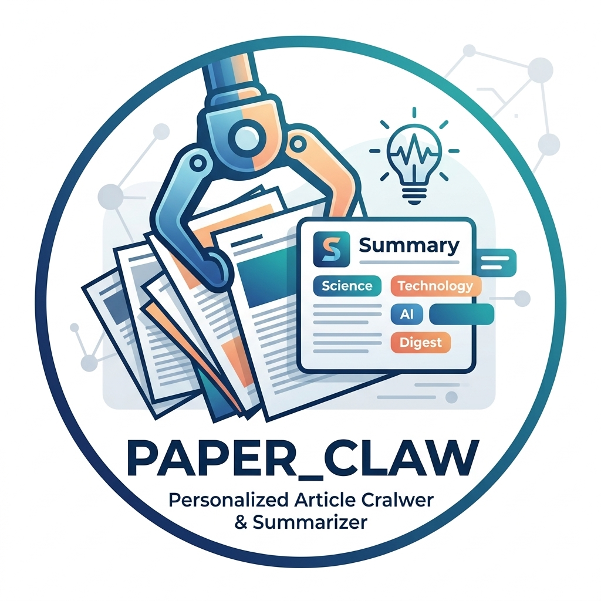

<div align="center">



# ���� Paper Claw

**Intelligent Multi-Source Paper Digest Generator**

[](https://www.python.org/)
[](LICENSE)
[](.github/workflows/daily_digest.yml)
[](https://github.com/yourusername/paper_claw)

*Fetch, classify, and summarize papers from multiple sources in multiple languages*

[English](README.md) 路 [绠�浣�涓����](README_CN.md) 路 [Quick Start](#-quick-start) 路 [ArXiv Categories](#-arxiv-categories) 路 [Agent Skill](#-for-agents--openclaw)

</div>

---

## ��?Features

<table>
<tr>
<td width="60%">

���� **Multi-Source Support**
- arXiv ��?170+ subject categories
- CNKI (��ョ��) ��?planned
- Web of Science ��?planned
- Extensible architecture

���ｏ�?**7 Languages**
�������� ���吼��� �������� ���梆��� �������� �������� ��������

���� **5 LLM Providers**
Kimi 路 OpenAI 路 Claude 路 Gemini 路 DeepSeek

</td>
<td width="40%">


</td>
</tr>
</table>

---

## ���� Quick Start

```bash
# Clone & install
git clone https://github.com/yourusername/paper_claw.git
cd paper_claw && pip install -r requirements.txt

# Configure
cp .env.example .env
cp config/recipients.example.json config/recipients.json

# Run (select your arXiv categories in config/default.json)
python scripts/main.py --day 2026-03-10 --language en
```

---

## ���� ArXiv Categories

<details>
<summary><b>���� How to Select Categories</b> ��?Click to expand</summary><br>

We provide **all 170+ arXiv subject categories** in `config/arxiv_categories.json`. 

**To select your categories:**

1. **Browse** the complete category list in `config/arxiv_categories.json`
2. **Choose** the categories relevant to your field
3. **Add** them to `config/default.json` under `sources.arxiv.categories`

**Example configuration:**

```json
{
  "sources": {
    "arxiv": {
      "enabled": true,
      "categories": [
        {"id": "cs.CL", "name": "Computation and Language", "url": "https://arxiv.org/list/cs.CL/recent"},
        {"id": "cs.CV", "name": "Computer Vision", "url": "https://arxiv.org/list/cs.CV/recent"},
        {"id": "cs.LG", "name": "Machine Learning", "url": "https://arxiv.org/list/cs.LG/recent"}
      ]
    }
  }
}
```

**URL Generation:**
The system automatically generates arXiv URLs from category IDs:
```
Category ID: cs.CL
Generated URL: https://arxiv.org/list/cs.CL/recent
```

</details>

<details>
<summary><b>���� Popular Category Combinations</b> ��?Click to expand</summary><br>

**���� AI/ML Research:**
```json
["cs.AI", "cs.LG", "cs.CL", "cs.CV", "stat.ML"]
```

**���ｏ�?Speech & Audio (Default):**
```json
["cs.SD", "eess.AS"]
```

**��К Computational Biology:**
```json
["q-bio.BM", "q-bio.GN", "q-bio.NC", "cs.CE"]
```

**���锔� Physics:**
```json
["physics.optics", "physics.chem-ph", "cond-mat.mtrl-sci"]
```

**���� Quantitative Finance:**
```json
["q-fin.PM", "q-fin.RM", "q-fin.ST", "q-fin.TR"]
```

**���� Interdisciplinary:**
```json
["cs.CY", "cs.HC", "cs.SI", "physics.soc-ph"]
```

See [`config/arxiv_categories.json`](config/arxiv_categories.json) for the **complete list** of 170+ categories.

</details>

---

## ���� For Agents & OpenClaw

<details open>
<summary><b>���� Quick Integration for AI Agents</b></summary><br>

Paper Claw provides a **standardized Skill interface** for AI agents like OpenClaw, Kimi, and other LLM-based tools.

### One-Line Integration

```python
from skill.example import fetch_papers, get_digest_content

# Fetch and summarize papers
result = fetch_papers(day="2026-03-10", language="en")
content = get_digest_content("2026-03-10", format="summary")
```

### Tool Definitions

Agents can discover capabilities via [`skill/tools.json`](skill/tools.json):

| Tool | Purpose | Parameters |
|------|---------|------------|
| `fetch_papers` | Fetch from configured sources | `day`, `language` |
| `configure_categories` | Update arXiv categories | `categories[]` |
| `configure_recipients` | Update email list | `recipients[]` |
| `configure_language` | Set output language | `language` |
| `get_digest_content` | Retrieve generated digest | `date`, `format` |

### Agent Configuration

```json
{
  "skill": "paper_claw",
  "config": {
    "sources": ["cs.AI", "cs.LG", "cs.CL"],
    "language": "en",
    "recipients": ["researcher@lab.edu"]
  }
}
```

### Complete Skill Documentation

���� **[skill/SKILL.md](skill/SKILL.md)** ��?Full integration guide  
���� **[skill/tools.json](skill/tools.json)** ��?Tool schema definitions  
���� **[skill/example.py](skill/example.py)** ��?Python usage examples

</details>

---

## ���� Configuration

<details>
<summary><b>���� Data Sources</b></summary><br>

Configure sources in `config/default.json`:

```json
{
  "sources": {
    "arxiv": {
      "enabled": true,
      "name": "arXiv",
      "url": "https://arxiv.org",
      "categories": [
        {"id": "cs.CL", "name": "NLP", "url": "https://arxiv.org/list/cs.CL/recent"}
      ]
    }
  }
}
```

</details>

<details>
<summary><b>���ｏ�?Language Settings</b></summary><br>

```bash
# Command line
python scripts/main.py --language ja  # Japanese

# Or config/default.json
{"language": {"default": "zh", "supported": ["zh", "en", "ja", "ko", "de", "fr", "es"]}}
```

</details>

<details>
<summary><b>���� LLM Providers</b></summary><br>

Set API keys in `.env`:
```bash
MOONSHOT_API_KEY=sk-xxx  # Recommended
OPENAI_API_KEY=sk-xxx
ANTHROPIC_API_KEY=sk-xxx
GOOGLE_API_KEY=xxx
DEEPSEEK_API_KEY=sk-xxx
```

Auto-fallback: Kimi ��?OpenAI ��?Claude ��?DeepSeek ��?Gemini ��?Rule-based

</details>

<details>
<summary><b>���� Email Setup</b></summary><br>

```bash
# .env
SMTP_HOST=smtp.qq.com
SMTP_PORT=465
SMTP_USER=your@email.com
SMTP_PASS=your-auth-code
```

```json
// config/recipients.json
{
  "recipients": [
    {"email": "user@example.com", "name": "User", "enabled": true}
  ]
}
```

</details>

---

## ���� Deployment

<details>
<summary><b>���锔� GitHub Actions</b></summary><br>

1. Fork repo
2. Add secrets: `SMTP_*`, `MOONSHOT_API_KEY`, etc.
3. Runs daily at UTC 01:00

</details>

<details>
<summary><b>���ワ�?Local</b></summary><br>

```bash
# Cron (Linux/Mac)
0 1 * * * cd /path/to/paper_claw && python scripts/main.py

# Windows Task Scheduler
schtasks /create /tn "ArticleClaw" /tr "python scripts/main.py" /sc daily /st 09:00
```

</details>

---

## ���� Project Structure

```
paper_claw/
��������� config/
��?  ��������� default.json              # Main config
��?  ��������� arxiv_categories.json     # 猸?170+ arXiv categories
��?  ��������� recipients.json           # Email recipients
��������� skill/                        # 猸?Agent Skill interface
��?  ��������� SKILL.md                  # Integration guide
��?  ��������� tools.json                # Tool definitions
��?  ��������� example.py                # Usage examples
��������� scripts/
��?  ��������� main.py                   # Entry point
��?  ��������� llm_client.py             # Multi-LLM support
��?  ��������� process_papers.py         # Multi-language processing
��������� content/posts/                # Generated digests
```

---

## ���猴�?Roadmap

- [x] arXiv ��?170+ categories
- [x] Multi-LLM (5 providers)
- [x] Multi-language (7 languages)
- [x] Agent Skill interface
- [ ] CNKI integration
- [ ] Web of Science integration
- [ ] Web UI

---

## ���� License

[MIT License](LICENSE) 漏 2026 Paper Claw Contributors

---

<div align="center">

**猸?Star this repo if you find it helpful!**

</div>
